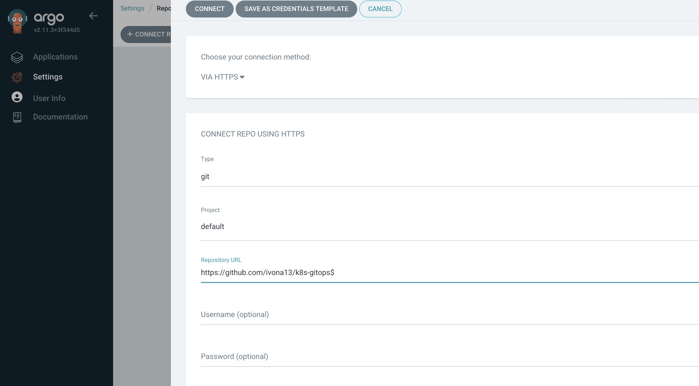
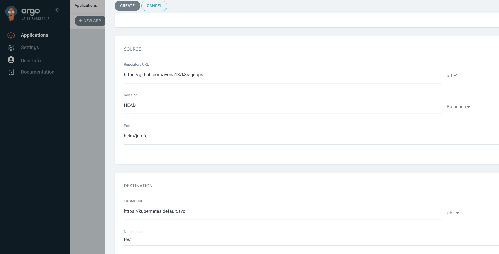
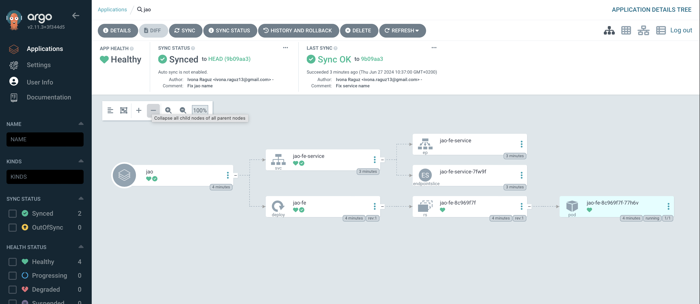

## Deploy to the minikube cluster using ArgoCD

Prerequisites:
- [Minikube](https://minikube.sigs.k8s.io/docs/start/)
- [ArgoCD](https://argoproj.github.io/argo-cd/getting_started/)
- [Helmify](https://github.com/arttor/helmify)
- [Helm](https://helm.sh/docs/intro/install/)

Task: Deploy the application to the minikube cluster using ArgoCD.

Steps:
1. Start the minikube cluster.
2. Install ArgoCD on the minikube cluster according to the [official documentation](https://argoproj.github.io/argo-cd/getting_started/).
   * ArgoCD has LoadBalancer for reaching its UI. You can use `minikube tunnel` to expose the LoadBalancer to your local machine.
   * You can also use `kubectl port-forward` to reach the ArgoCD UI. qi5zSChLorwdHQRo
   * The default username is `admin` and the password is revealed with the command: 
   ```
   kubectl -n argocd get secret argocd-initial-admin-secret -o jsonpath="{.data.password}" | base64 -d
   ```
3. Install Helmify and Helm on your local machine.
4. Write down k8s yaml files for the application.
5. Helmify the k8s yaml files with the command:
```
   helmify -f /my_directory mychart
   ```
6. Commit configuration files to the repository on GitHub
7. Configure repo on the ArgoCD



8. Configure ArgoCD to "look" at the Helm chart repo -> create new <b>Application</b>




